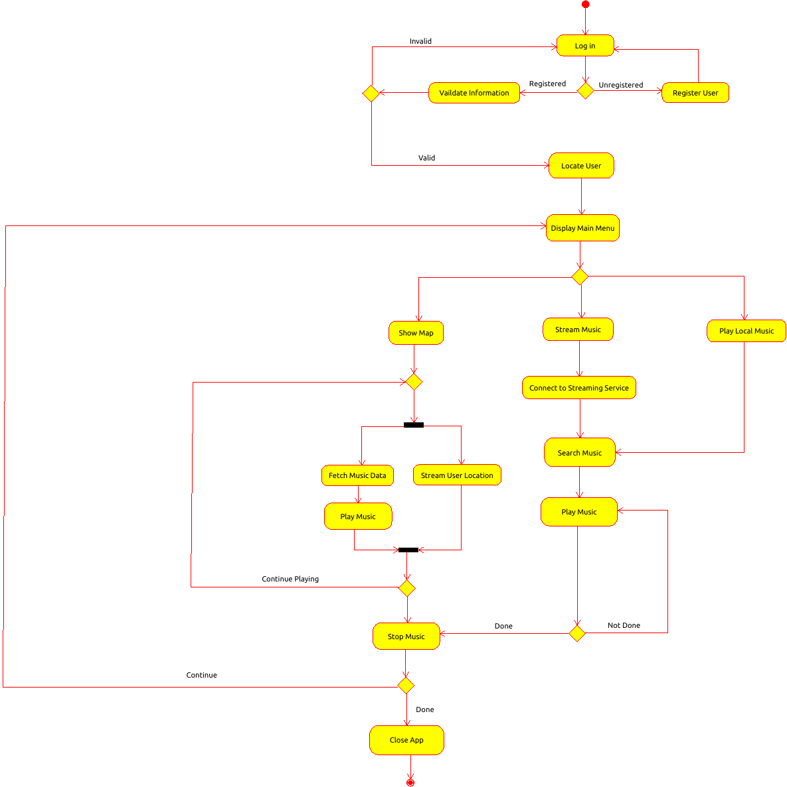
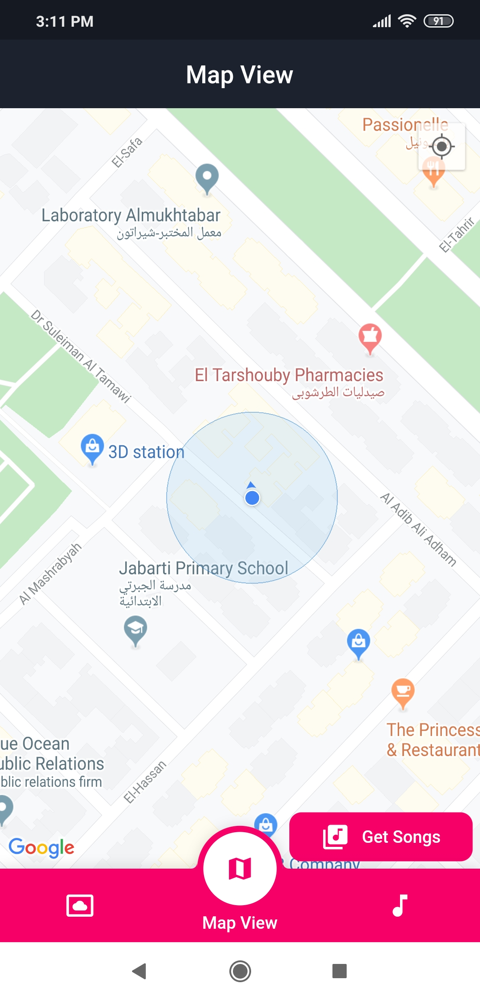
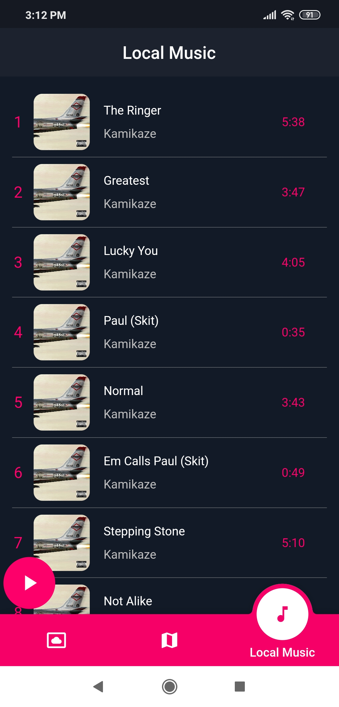
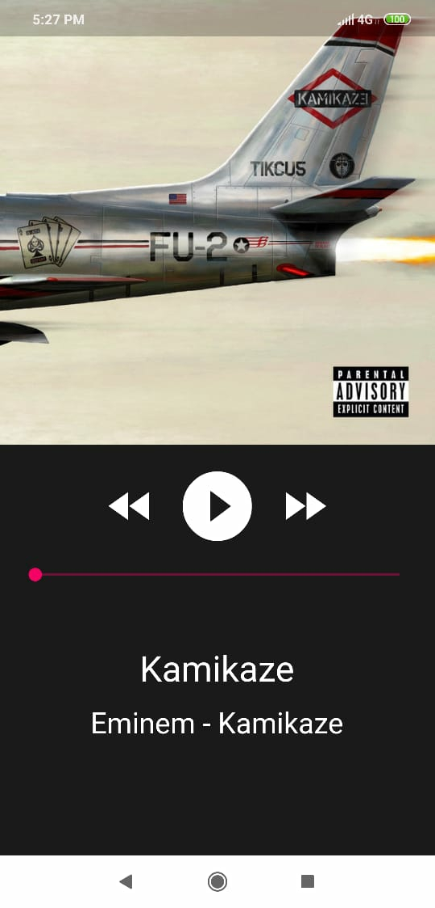

# RoadTrax

A location-based music mobile application established using Flutter and Google’s Firebase

## How to Run
- Clone the repo.

- Run the command `flutter run` using the terminal in the project's directory.

## Current Features

[✓] Display tredning songs according to the user's location

[✓] Play offline music through your local files

[✓] retrieve songs from Spotify's API

[✓] Music reccomendation (experimental)

## Entity Diagram

## Screenshots

  
